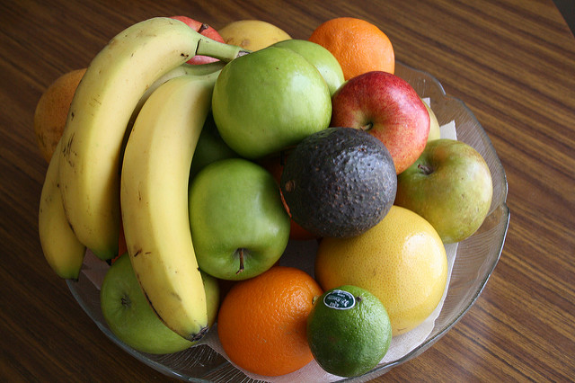

# AI training
How to learn AI Service develepment.

* 1.導入　　
* 2.サービスを使ってみる　　
* 3.API解説　　

# 1.導入

## 画像に何が映っているでしょうか？



バナナ、青りんご、オレンジ、etc、、  
人が見て、画像に含まれるものをあげるのは、比較的簡単です。　　

## ヒトではなく、機械に画像を見せると、、、
```
モノの名前 ： スコア(%)

規定食 (食品):0.579%
食物:0.579%
果実:0.826%
バナナ:0.532%
ゴールデン・デリシャス:0.508%
生食用リンゴ:0.641%
リンゴ:0.654%
ナシ状果:0.669%
グラニー・スミス:0.5%
オリーブ色:0.943%
レモン・イエロー (色):0.898%
```

# 2.サービスを使ってみる

## 画像認識サービスAPIのリンク
https://gateway-a.watsonplatform.net/visual-recognition/api/v3/classify?api_key=befb491ae8c532e1db72518f6da8088bb2bd1b52&url=https://namickey.github.io/ai_train_2018/img/fruitbowl.jpg&version=2016-05-20

## IBMクラウド
上記の画像認識サービスは、IBMクラウドが提供している画像認識APIを使用しています。　　

# 3.API解説

## APIのパラメータ
```
https://gateway-a.watsonplatform.net/visual-recognition/api/v3/classify?
api_key=befb491ae8c532e1db72518f6da8088bb2bd1b52&
url=https://namickey.github.io/ai_train_2018/img/fruitbowl.jpg&
version=2016-05-20

※読みやすいように改行を入れているので注意。
```

パラメータ  
* api_key：APIの利用に必要なキー。  
* url：任意の画像URL  
* version：指定された固定バージョンを入力する。  

## 任意の別の画像を指定する

* 試してみたい画像URLをコピーする。  
  必ずインターネット上の画像URLであること。  
* コピーした画像URLを、APIパラメータの２番目（url）と置き換える。  
* ブラウザに完成したAPIのURLを入力する。  

## Try　やってみよう

* IBMクラウドの無料アカウントに登録する。　　
  ※クレジットカード不要で、10日又は1ヶ月放置すると自動的にアカウント停止となる。　　
* カタログから、画像認識サービスの申込みをする。　　
* api_keyの発行を行う。　　
